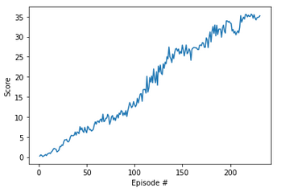

# Udacity's Continuous Control on Reacher Environment training report

## Algorithm


This projects implements the popular Deep Deterministic Policy Gradient (_DDPG_) based on this [paper](https://arxiv.org/pdf/1509.02971.pdf).
The algorithm is based on the DDPG coding exercise of the Udacity Deep Reinforcement Learning course. 
The DDPG algorithm is a model-free off-policy algorithms for conitnuous action spaces. It uses experience replay through 
a replay buffer and slow-learning target networks (similar to DQN).

The Actor-critic method uses 2 networks:
- An actor network that predicts actions from the state observations with the following network structure
```
input layer (33 observations)
fully connected hidden layer 1 (33 -> 128 with relu activation)
fully connected hidden layer 2 (128 -> 64 with relu activation)
output layer (64 -> 4 with tanh activation)
```
- A critic network that predicts Q-values which is a measure of whether the chosen action is good
```
input layer (33 observations)
fully connected hidden layer 1 (33 -> 128 with relu activation)
fully connected hidden layer 2 (128+4 -> 64 with relu activation)
output layer (64 -> 1 no activation)
```

[comment]: <> (![Network Architecture]&#40;data/neural_net2.jpeg&#41;)

## Hyper-parameters

| Hyper-parameter name | Value   | Detailed meaning                       |
| :---:                |:----:   | :---:                                  |
| batch-size     | 128      | Number of samples trained in each step |
| τ               | 1e-3    | Soft update for target network weights |
| γ             | 0.99    | Discount factor                        |
| Replay buffer size   | 1e6     | Capacity of the replay buffer          |
| α	             | 2e-3    | Learning rate actor     |
| β	             | 2e-3    | Learning rate critic     |
| Weight decay    | 0   | L2 Weight Decay                 |

## Results

The problem is solved (average reward > 30.0) in 131 episodes. A plot of the training curve is shown below




[comment]: <> (![Trained banana agent]&#40;data/trained_agent_20.gif&#41;)

## Improvements

For now, no batch normalization is used when values enter the networks. Applying batch normalization could stabilize training 
by obtaining better gradient flow. 

Next to that, future work will address implementation of more advanced techniques such as _D4PG_, _PPO_ or _A3C_. 


